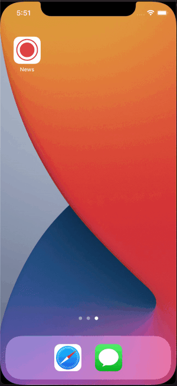

# News

## Requirements
Please create a new application with following conditions
1. Use https://newsapi.org/ as data source
2. Application must be written in Kotlin OR Swift
3.  Application must be written in MVVM and MVP, and write a test case.
4. Use any framework and library that you know and understand
5. Application must have this feature:
    a. News List with image
    b. News detail with image
    c. Link to open original news
    d. Have 3 tab view at home and it will show list about:
        i. Top Headline news with image
        ii. Custom news based on user preferences (user must be presented with keyword selection from: bitcoin, apple, earthquake, animal. User can only choose one keyword)
        iii. Profile
6. User can register with username at profile and data (user preferences) will be saved on local storage
7. Please initialize version control with git for checking git history
8. Please upload to Github

------
# Setup & Run
### Setup Cocoapods
This project uses Cocoapods to manage 3rd parties, you have to run some commands to setup it.
1. Open Terminal App
2. $ `sudo gem install cocoapods`
3. enter your computer password, then enjoy a cup of tea and wait for installing

You can refer to the offical information here [cocoapods.org](https://cocoapods.org)

### Install 3rd parties & open App
1. Open Terminal app
2. $ `cd <the/path/to/project>`
3. $ `pod install`
4. $ `open News.xcworkspace`

### Preview

